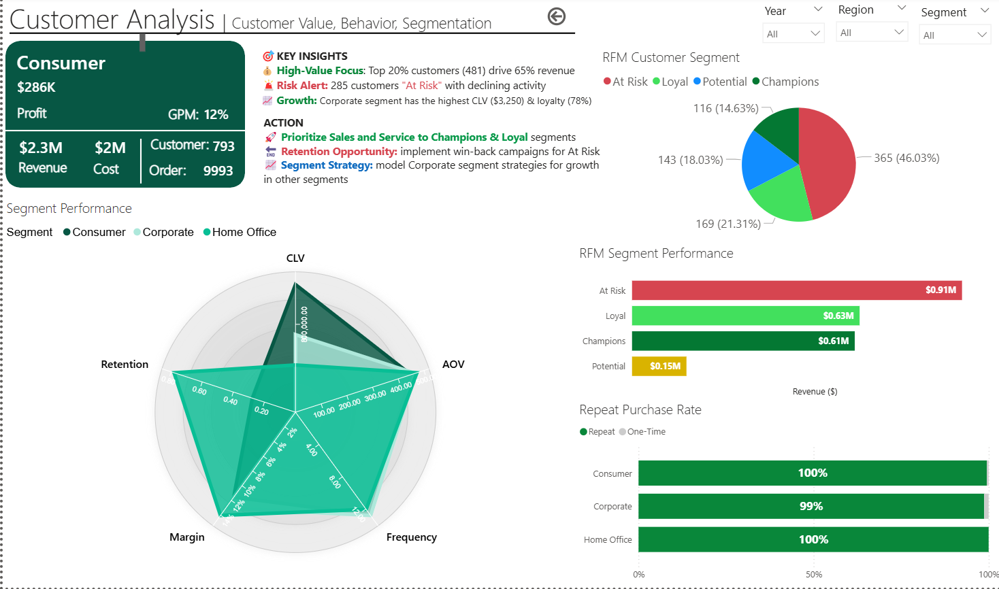
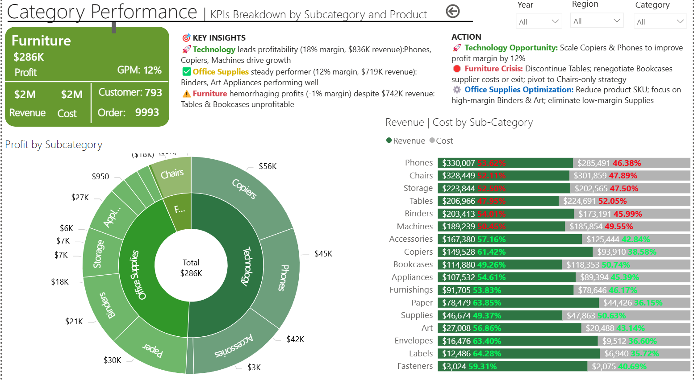
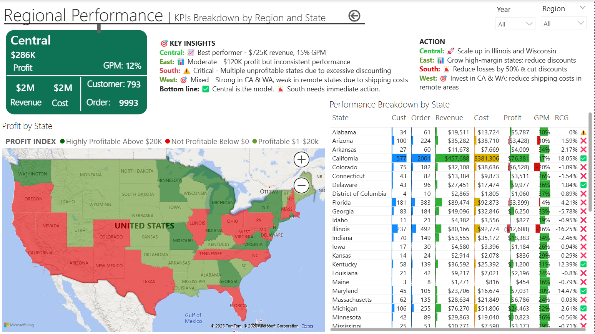

# SuperStore Business Intelligence Dashboard
> Multi-page analytics platform delivering $84K profit improvement opportunities through data-driven insights

## Overview

A comprehensive business intelligence solution analyzing **$733K in revenue** across **3,203 orders** and **793 customers**. This five-page interactive dashboard transforms raw transactional data into actionable insights, identifying critical business issues and quantifying improvement opportunities.

### Business Context
- **Revenue**: $733K (+12.3% YoY)
- **Profit**: $93K (12.7% margin)
- **Challenge**: Declining margins, high customer churn, and operational inefficiencies
- **Opportunity**: $84K profit improvement (90% increase) through targeted interventions

### Problem Statement
Despite revenue growth, the business faces:
- 46% of customers showing declining activity (285 customers, $217K at risk)
- Furniture category hemorrhaging profit at -1% margin
- West region shipping costs 2.3x higher than Central region
- Excessive discounting destroying profitability (390 orders at <2% margin)

## Business Impact

### Critical Issues Identified

| Problem | Impact | Root Cause |
|---------|--------|------------|
| Customer Churn Risk | $217K revenue at risk | 285 customers in "At Risk" segment |
| Furniture Category Crisis | -$12K monthly loss | Tables & Bookcases unprofitable |
| West Region Inefficiency | +$15K extra costs | Shipping $49/order vs $22 Central |
| Discount Abuse | -$82K profit erosion | 11.2% avg discount vs 8% target |
| Premium Shipping Overuse | -$8K opportunity cost | Same Day: 6.1% margin vs Standard: 14.2% |

### Solutions & ROI

| Initiative | Annual Impact | Implementation | Priority |
|------------|---------------|----------------|----------|
| 🚚 Shipping Optimization | **+$28K** | Restrict Same Day, negotiate West rates | High |
| 💰 Discount Control | **+$23K** | Cap at 20%, tiered pricing | High |
| 📦 Product Mix Shift | **+$18K** | Scale Tech from 35% to 45% | Medium |
| ❌ Exit Unprofitable SKUs | **+$15K** | Discontinue Tables/Bookcases | High |
| **Total Profit Improvement** | **+$84K (90%)** | 12-month roadmap | - |

### Strategic Recommendations

**Immediate Actions (Q1 2024)**
1. Implement 20% maximum discount policy
2. Restrict Same Day shipping to orders >$500
3. Discontinue bottom 5 furniture SKUs
4. Launch win-back campaign for 285 At-Risk customers

**Medium-term (Q2-Q3 2024)**
5. Open West Coast fulfillment center or negotiate regional carrier rates
6. Shift marketing budget toward Technology products
7. Implement loyalty program for Champion customers

**Long-term (Q4 2024+)**
8. Exit unprofitable South region states or restructure operations
9. Develop predictive churn model
10. Optimize product catalog based on profitability data

## Key Features

### 📊 Five Integrated Dashboards
- **Executive Summary**: Strategic overview with KPIs and action priorities
- **Customer Analysis**: RFM segmentation and lifetime value analysis
- **Category Performance**: Product profitability and portfolio optimization
- **Regional Performance**: Geographic intelligence and cost patterns
- **Profitability Analysis**: Margin drivers and cost structure deep-dive

### 🎯 Advanced Analytics
- **RFM Segmentation**: 4-tier customer classification (Champion, Loyal, At Risk, Potential)
- **Customer Lifetime Value**: Predictive CLV modeling
- **Cohort Analysis**: Retention rates by segment
- **Margin Waterfall**: Revenue-to-profit decomposition
- **Cost Attribution**: Shipping and discount impact quantification

### 💡 Interactive Features
- Dynamic filters (Year, Region, Segment, Category)
- Drill-down capabilities (Region → State → City)
- Comparative analysis (YoY, segment benchmarking)

## Technical Implementation

### Data Architecture
```
Star Schema Design:
├── Fact_Orders (9,994 rows)
│   ├── Order ID, Order Date, Ship Date
│   ├── Sales, Profit, Quantity, Discount
│   └── Foreign Keys: Customer ID, Product ID, Location ID
├── Dim_Customer (793 rows)
│   ├── Customer ID, Name, Segment
│   └── RFM Score, CLV, Loyalty Status
├── Dim_Product (1,862 rows)
│   ├── Product ID, Name, Category, Sub-Category
│   └── Unit Price, Unit Cost, Margin %
├── Dim_Location (531 rows)
│   ├── City, State, Region, Postal Code
│   └── Shipping Zone, Distance Tier
└── Dim_Date (1,461 days)
    ├── Date, Month, Quarter, Year
    └── Fiscal Period, Holiday Flag
```
## Screenshots

### Executive Summary

*Strategic KPIs, critical alerts, and performance scorecards*

### Customer Analysis

*Customer health monitoring with RFM segmentation and CLV analysis*

### Category Performance

*Product portfolio analysis identifying top and bottom performers*

### Regional Performance

*State-level profitability and shipping cost patterns*

### Profitability Analysis

*Cost structure breakdown and optimization opportunities*

## Methodology

### Data Collection
- **Source**: SuperStore transactional database (2019-2022)
- **Records**: 9,994 orders, 793 customers, 1,862 products
- **Frequency**: Daily extracts with incremental refresh
- **Validation**: Automated data quality checks on load

### Analysis Approach

**1. RFM Segmentation**
- Recency: Days since last purchase (quintiles)
- Frequency: Number of orders (quintiles)
- Monetary: Total spend (quintiles)
- Combined score creates 125 potential segments, grouped into 4 strategic segments

**2. Profitability Attribution**
```
Net Profit = Revenue - Product Cost - Shipping Cost - Discount - Returns
Contribution Margin = Revenue - Variable Costs
Profit Margin % = Net Profit / Revenue
```

**3. Geographic Analysis**
- State-level profitability calculation
- Shipping cost attribution by distance and zone
- Regional benchmarking against best performers

**4. Product Portfolio Matrix**
- Revenue vs Profit margin classification
- Market share analysis by category
- SKU rationalization based on contribution margin

### Assumptions
- Customer retention rate: 70% baseline
- CLV discount rate: 10% annually
- Shipping zone assignments based on ZIP code centroids
- Discount impact calculated on gross margin basis

### Limitations
- Historical data only (no predictive modeling yet)
- External factors (economy, competition) not included
- Assumes current pricing structure remains constant
- Shipping costs based on list rates (actual may vary)

## Project Structure
```
superstore-dashboard/
├── README.md
├── LICENSE
├── .gitignore
├── data/
│   ├── Sample-Superstore.csv
│   └── data-dictionary.md
├── dashboards/
│   ├── superstore-analysis.twbx (Tableau)
│   └── superstore-analysis.pbix (Power BI)
├── images/
│   ├── executive-summary.png
│   ├── customer-analysis.png
│   ├── category-performance.png
│   ├── regional-performance.png
│   ├── profitability-analysis.png
│   └── shipping-analysis.png
├── docs/
│   ├── insights-report.pdf
│   ├── dax-formulas.md
│   ├── data-model-diagram.png
│   └── kpi-definitions.md
└── sql/
    ├── data-prep.sql
    └── validation-queries.sql
```
## Contributing

Contributions are welcome! Please follow these steps:

1. Fork the repository
2. Create a feature branch (`git checkout -b feature/AmazingFeature`)
3. Commit your changes (`git commit -m 'Add AmazingFeature'`)
4. Push to the branch (`git push origin feature/AmazingFeature`)
5. Open a Pull Request

### Contribution Guidelines
- Follow existing DAX naming conventions
- Add documentation for new calculations
- Include screenshots for UI changes
- Test with sample data before committing

## License

This project is licensed under the MIT License - see the [LICENSE](LICENSE) file for details.

## Acknowledgments

- **Data Source**: Tableau Sample SuperStore Dataset
- **Tools**: Power BI Desktop, DAX Studio
- **Inspiration**: Data visualization best practices from Stephen Few and Edward Tufte
- **Community**: Tableau Public community for design inspiration

## Contact

**[Oladigbolu Taofeek]**
- 📧 Email: taofeekoladigbolu@gmail.com
- 🐙 GitHub: [@Taofeek11](https://github.com/Taofeek11)


**⭐ If you found this project helpful, please consider giving it a star!**

---

*Last Updated: December 2024*
